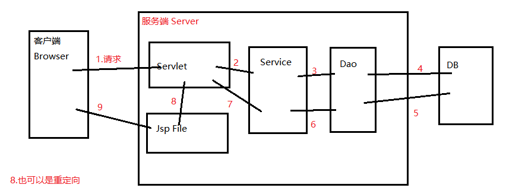

# Mall
From ItCast Learning.Basic Web

## Reference
链接：https://pan.baidu.com/s/1pVMz5cTP1hdmIo5kMfCr-Q 
码：m2mc

## Note

1. #### 概要

   这是一个最基础的Java EE Web项目——**商城类**。

   项目内容可能过于浅显，笔者是前段时间接触框架时遇到了一些基础问题，又重新拿起快速梳理的一遍。项目很容易上手，也适合复习基础的Java Web知识。之前上学时也做过类似的项目，那个还是比这个美观漂亮的多的，详见 [**OnlineFoodCourt**](https://github.com/fanleehao/OnlineFoodCourt)。

   项目的文档及所有资源（含视频教程）均在上文的链接中，可自取（另B站也可便捷观看，[传送](https://www.bilibili.com/video/av35377300)）。其中重要的文档和笔记，已经整理到项目下的**reference**中。

2. #### 涉及技术点

   项目使用的是Servlet + JSP + MySQL + Redis 搭建的，使用Tomcat作为服务器容器，没有用到框架相关的任何知识。

   项目中通过既有的静态网页原型，改成了JSP文件；通过JSP中的各种请求方式，向服务端发送请求得到响应结果，最终渲染在JSP中返回给客户端。主要是使用了 “ 接口 +  实现类 ” ，分层 “ Web + Servlet + Dao ” 两种主体的设计思路，分模块进行开发设计。

   **工作流（主）：**

    

   - 客户端请求方式有：超链接、表单的action、便签的click事件（Ajax异步加载）等。*默认：所有客户端的请求都不直接请求jsp，而有Servlet转向jsp响应*
   - 服务端响应：转发、重定向（重定向是二次请求，且不保留同一组的request/response）
   - 开发的步骤，其实就是上图数字的顺序。

3. #### 模块

   案例被拆分成了前台用户和后台管理两大块。

   前台包括**用户模块**、**商品模块**、**购物车**、**订单**，后台有对应的**分类管理**、**商品管理**、**订单管理**。

   - 用户模块：使用了Session标记用户，主要是一个控制访问权限过滤，有些页面如购物车和订单等不登录无法查看。使用Cookie来标记已登录的用户，主要是实现记住登录或者勾选记住用户名等。关于session和cookie的联系和区别可看我的[另一篇笔记](https://blog.csdn.net/qq_28666193/article/details/85100408)。
   - 商品模块：从首页的配置，动态获取如“分类信息”、“最新商品”、“热门商品”等。其中如一些变化不频繁的信息如分类信息，可使用redis缓存控制，提升性能。   商品分类查询时做了分页处理，主要是加载了一个分类的类，控制页面的输出。
   - 购物车：抽取出购物车模型和购物项模型，这个在数据库中并不存在。把购物项组成的购物车添加到session中。**注：**这里并没有把购物车和用户的session联系起来，其实是可以处理的。
   - 订单：根据需要抽离订单和明细两个模型。这里要保证，提交订单和订单项的操作具有事务性。支付模型，调用第三方的插件和工具即可（这个之前没有做过）。
   - **后台管理**：同样具有管理员的登录控制。Html中使用Dtree组件和frameWork组件构成。主要涉及到文件上传的问题，使用Commons-io等jar包完成。
   - 注：eclipse开发中，注意mysql配置的中文乱码问题。

4. #### 问题和工具

   在完成这个项目的时候，会遇到一些问题，这里主要选择几个我之前不熟悉的地方记录：

   - Redis: 一种数据存储库，主要以key-value的形式存储数据，如Set，list格式。Redis使用内存管理，默认安装启动后拥有16个（0~15）个数据库。支持高效快速的读写，所有操作都是原子性的。Redis支持消息订阅和发布模式。**事务**：Redis的操作都是串行化的，拥有事务的最高隔离级别。  Redis中的数据可以进行落盘（快照或是日志记录形式）持久化。
   - BasicServlet：抽离出基础的Servlet，通过参数控制使请求的反射执行不同方法多态。减少了重复性代码。Servlet的基本执行逻辑：init()----service()-----doGet/doPost()-----执行体。在最近基类的方法中寻找service方法，根据参数是get或post调用不同的方法（多态），重写service后则直接执行其中的逻辑。
   - 响应数据：使用Request.setAttribute+EL 表达式，或AJax异步加载（response.getWriter().println()）,
     或者存在session中，或使用Redis------(如首页的分类信息)
   - **Q1**: 
     在进行用户注册时，要控制**事务性**；如果邮件发送失败，则数据库注册的用户需要回滚，不能添加到注册但未激活的账户数据表中，否则该邮箱无法进行重新注册。
   - **Q2**:
      查询对象时，需要将查询到的数据通过反射机制，装载到一个对象中。——可以使用工具类BeanUtils.populate方法自动装配。———使用QueryRunner工具可以直接查询DB的时候，返回装配好的Bean。
   - **Q3**: 
     EL表达式中，${}依次访问的四个域为：pageContext, request.getAttribute, session, ServletContext，去找其中是否包含某个属性或对象。使用 \${对象.属性名}，其实是调用了对象的get属性名方法。
   - **Q4**:
     Servlet是一种容器，在运行中会被多个线程访问同一份的引用（在Spring中可以配置单例和多例模式）。
   - **Q5:**
     Session的使用，例如购物车可以保存么？可以，使用session的监听机制，在其失效前，获取其中的存储到数据库中。
   - **Q6**:
     同一个表单下，如何设置不同的提交方式？不设置表单中的submit，使用不同标签的click事件，JS异步记载。
   - **Q7**:
     转发和重定向？转发只有一次请求，且只能到当前项目下。性能快。
     重定向有两次请求，在地址栏中看到的是最后一次的请求的数据，会丢失第一次的request。一般，在重复提交数据的时候，使用重定向，保证了数据的一致性。
   - **Q8**:
     在查询某个用户的所有订单时，先查询该用户的所有订单，根据这些订单号，查询每个订单下的订单明细项。由于明细关于产品的信息在产品表中，则需要通过联合查询，给出满足条件的集合。**QueryRunner**中使用了一个MapListHandler的类进行装配。它是一个由map构成的list，每一个listitem代表结果的一行，一个map<string, object>表示表头对应的值的键值对序列。
   - **Q9**:
     使用Redis时，一旦出现对Redis引用的数据做了DB的修改，则一定要注意修改Redis内容。
   - **Q10**:
     文件上传中，使用\<input type="file">，form中要加上属性enctype=“multipart/form-data”。此时不能再通过request.getParameter获取。该方式获取的是请求表单和请求体中的数据。 需要使用输入流对象获取。
     在上传文件中，一般存在文件重名的覆盖问题（使用UUID工具），和同文件路径下的访问性能问题（使用多级多个路径解决，如hashcode的字符路径方式）

5. #### 部署

   部署到某个Linux服务器中，安装相关的Tomcat/MySQL/Redis/等，主要是Tomcat容器必须有，其他的服务可以修改到对应安装的地址到配置文件中即可。

   将项目导出成War包/Jar包，上传到Tomcat 对应的WebApps文件下，启动对应的端口。第一次需要加载到容器中，比价慢，后续正常。

6. #### 工具类

   - UUID   生产码
   - BeanUtils   装配Bean
   - 过滤器：编码、登录等
   - BeanFactory   工厂解耦
   - JDBC、Jedis    数据库
   - 支付，加密等
   - 上传文件  发送邮件等

